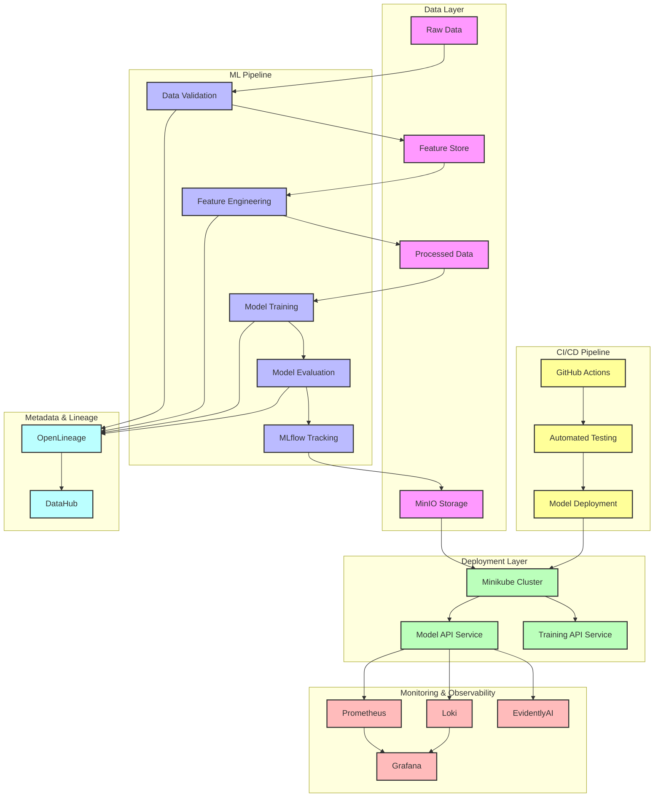

# System Architecture

## Architecture Components

### Data Layer
- **Raw Data**: Initial input datasets
- **Feature Store**: Centralized feature storage and transformation
- **Processed Data**: Cleaned and transformed data ready for training
- **MinIO Storage**: S3-compatible storage for artifacts

### ML Pipeline
- **Data Validation**: Schema and statistical validation
- **Feature Engineering**: Consistent feature transformation
- **Model Training**: ML model development
- **Model Evaluation**: Performance assessment
- **MLflow Tracking**: Experiment tracking and model versioning

### Deployment Layer
- **Minikube Cluster**: Local Kubernetes environment
- **Model API Service**: FastAPI-based model serving
- **Training API Service**: API for triggering retraining

### Monitoring & Observability
- **Prometheus**: Metrics collection
- **Grafana**: Visualization and dashboards
- **Loki**: Log aggregation
- **EvidentlyAI**: Data drift detection

### CI/CD Pipeline
- **GitHub Actions**: Automated workflows
- **Automated Testing**: Unit, integration, and E2E tests
- **Model Deployment**: Automated deployment process

### Metadata & Lineage
- **OpenLineage**: Data and model lineage tracking
- **DataHub**: Metadata management and visualization

## Data Flow
1. Raw data undergoes validation and processing
2. Features are engineered and stored in the feature store
3. Models are trained and evaluated using MLflow
4. Artifacts are stored in MinIO
5. Models are deployed to the Minikube cluster
6. Performance is monitored through Prometheus and Grafana
7. Logs are collected by Loki
8. Data drift is monitored by EvidentlyAI
9. Lineage is tracked through OpenLineage and DataHub 